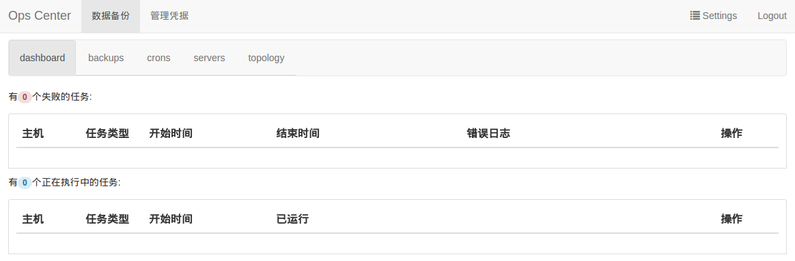
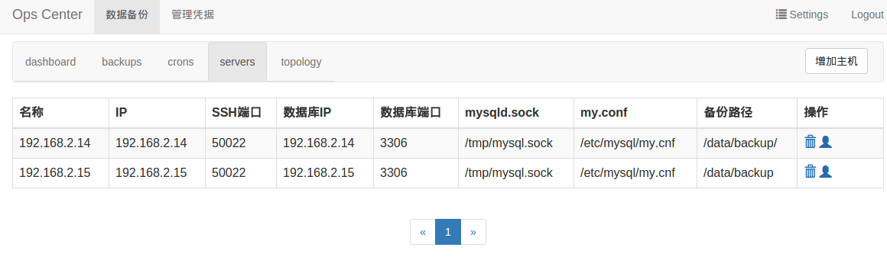
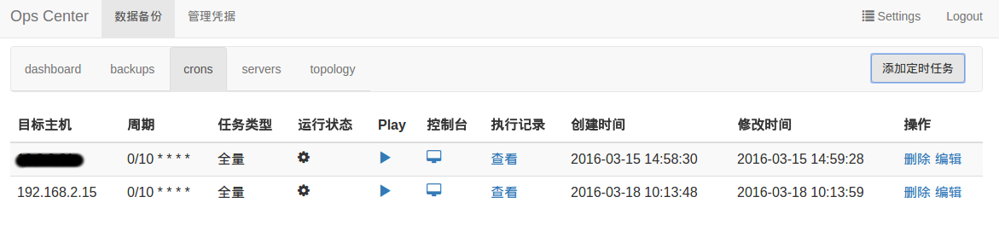
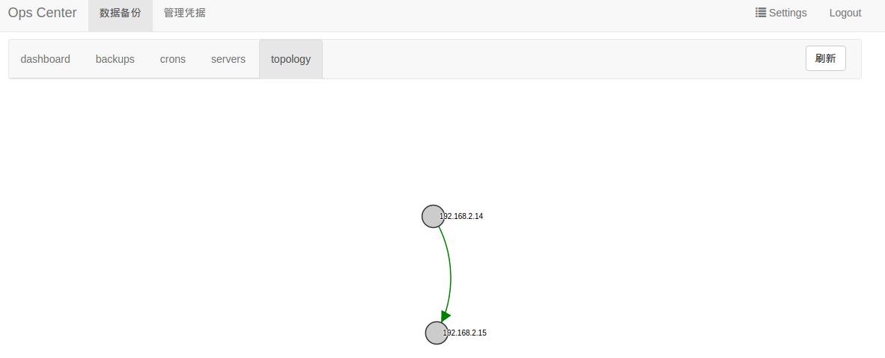

###系统介绍
大多数公司的业务数据基本都存放在数据库中，需要频繁的进行数据库读写。数据库数据的的安全性，灾后恢复，业务扩大后的数据库扩展因此越来越重要。

对数据库数据的备份成了公司DBA的日常工作，并且提出了很高的要求：数据按时备份，数据备份准确，能够随时拿来进行灾后恢复。

目前公司使用第三方软件 [xtrabackup](https://www.percona.com/doc/percona-xtrabackup/2.4/index.html "xtrabackup") 进行数据库数据备份，但存在一些问题：
- 需要登录数据库机器，拷贝shell脚本，配置cron定时执行数据库备份
- 数据库备份结果不能直观查看，需要登录数据库机器，查看备份log
- 业务扩展增加数据库机器后，需要重复上面两步

从上面问题可以看出，随着公司规模扩张，业务线越来越复杂，为了维护数据库备份这一工作投入的人力成本花销快速增长。

为了解决这一问题，我们使用golang开发了一套数据库管理系统，提供统一的平台，用户只需要配置一些必要的信息，就可以在平台上快速维护数据库备份工作。

### 主要特性

- 支持mysql数据库全库，增量备份
- 支持数据库备份文件压缩
- 支持过期备份数据删除
- 支持mysql数据库主从网络拓扑实时显示

### 编译
-  [安装golang](https://golang.org/doc/install "安装golang")

- 编译
```shell
cd ops-center
go build ops-center.go
```

### 配置
```json
{
  "ip":"0.0.0.0",                    #ip地址
  "port":"8080",                     #端口号
  "site_name":"operations center",   #系统名称
  "mongo":"0.0.0.0:0000",            #数据库IP及端口
  "sshPrivateKey":"/.ssh/id_rsa",    #SSH私钥路径（不需要加root或其他用户）
  "shellname":"xbackup.sh",          #不需要修改
  "systemid" : "2",                                         
  "ssoverifyurl":"http://xxxx/session",
  "redirecturl":"http://xxxx/web/login.html"
}
```
### 依赖
- SSH

### 运行
```shell
cd ops-center
./ops-center
```

###使用手册
 1. 运行程序

 2. 浏览器输入http://127.0.0.1:8080，就可以打开系统web界面
 
	1. dashboard 任务监控
         显示当前系统中正在运行和运行失败的任务情况
	1. backups 备份数据
		按照不同的机器，显示该机器上备份的数据库数据
	1. crons 定时任务配置
		配置机器上可以执行的各种定时任务
	1. servers 机器配置
		配置机器信息，机器上面的mysql信息
	1. topology 数据库主从网络拓扑
		实时显示数据库主从网络拓扑及同步情况

 3. 配置机器 

	 1. mysql数据库机器
	     - [安装xtrabackup](https://www.percona.com/doc/percona-xtrabackup/2.4/index.html "安装xtrabackup")
	     - mysql创建备份账户
	     - 建立数据库备份文件存放目录
	```shell
	mkdir /data/backup/
	```
	 2. web页面配置
配置项主要包括：机器名称，IP，SSH端口，数据库IP、端口、cnf路径，sock路径，备份过程使用的数据库用户名、用户密码，备份文件存放路径。


 4. 配置SSH
  1. 生成SSH公私钥
	```shell
	ssh-keygen
	```

  2. 得到SSH公钥的内容
	```shell
	### ops-center # cd /root/.ssh/
	### .ssh # ls
	id_rsa  id_rsa.pub  known_hosts
	### .ssh # cat id_rsa.pub
	ssh-rsa AAAAB3N.............................OHwxYYkocb+XV1t3pCtcbnuH5iJ root@###
	```

  3. 拷贝公钥到数据库机器
	```shell
	### ops-center # ssh -p 50022 dba@192.168.2.15
	dba@****:~/.ssh$ cd ~/.ssh/
	dba@****:~/.ssh$ ls
	authorized_keys
	dba@****:~/.ssh$ cat ssh-rsa AAAAB3N.....root@### >> authorized_keys
	```
 5. crons页面设置定时任务
	 
	1. 选择“添加定时任务”，选择机器名，任务类型，设置cron类型时间点后
	1. 添加后，任务就进入预运行状态，等待设置时间到达后，开始任务执行
	1. 点击“暂停”按钮，暂停运行完毕的定时任务
	1. 点击“控制台”按钮，查看选中的定时任务执行过程信息
	1. 点击“查看”按钮，查看该定时任务历史执行结果记录信息
	1. 点击“编辑”按钮，对选中的定时任务进行编辑
	1. 点击“删除”按钮，删除选中的定时任务

 6. topology页面
 
该页面显示数据库主从拓扑，实时同步状态。
箭头指向代表同步方向；曲线实线代表同步状态良好，虚线代表同步存在问题。

###提交Bug & 建议
 [bug](https://github.com/pandao/editor.md/issues "bug")
 
